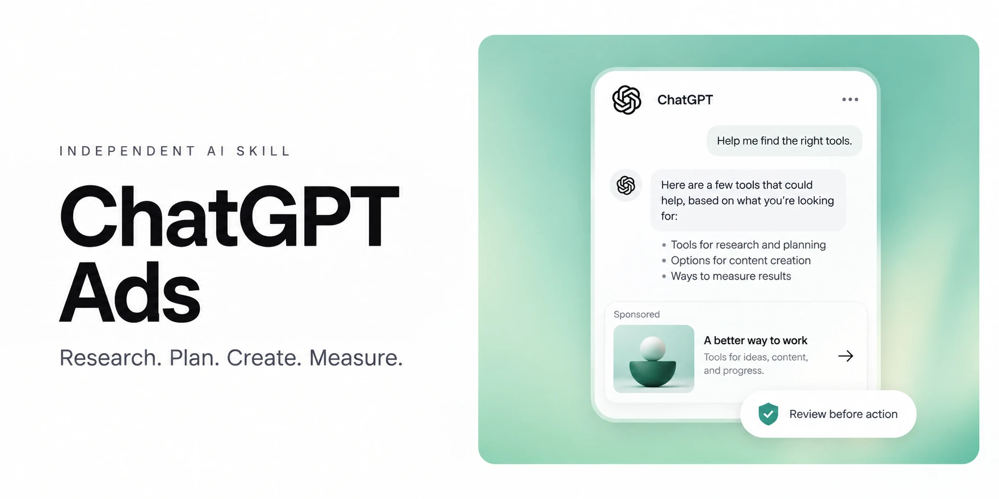
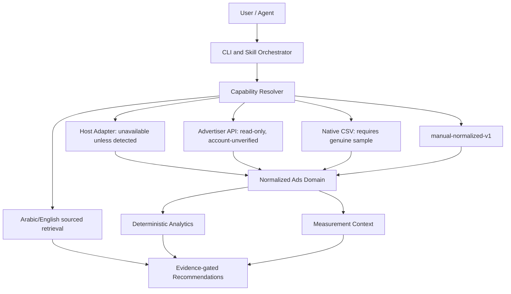

# ChatGPT Ads



[](LICENSE)

[](https://github.com/imMamdouhaboammar/chatgpt-ads/actions/workflows/ci.yml)
[](marketplace.json)
[](.codex-plugin/plugin.json)
[](.skills.json)
[](package.json)

An independent, MIT-licensed toolkit for sourced research, native read-only account analysis, campaign planning, measurement diagnostics, and guarded ChatGPT Ads agent workflows. Authored and maintained by **Mamdouh Aboammar**.

It provides zero-vendor-lockin multi-agent support across **OpenAI Codex**, **Claude Code / Desktop**, **Google Antigravity / Gemini CLI**, **Cursor**, and **Skills.sh**. It is not an official OpenAI product or endorsement.

## Capability status

**Works locally:** deterministic Arabic/English hybrid knowledge retrieval, normalized CSV aggregate analysis, provider-neutral domain models, capability resolution, source-change comparison, and the product CLI.

**Implemented but account-unverified:** the read-only OpenAI Advertiser API adapter for account metadata, campaign/ad-group/ad lists, delivery insights, conversion event settings/sources, and conversion insights. Configure it only through `OPENAI_ADS_API_KEY`; synthetic contract tests do not prove access for any account.

**Experimental:** native CSV adaptation still requires a sanitized genuine native export and reviewed mapping.

**Not available:** campaign writes, live action automation, and scheduling. A documented or configured capability is not proof of delivery, attribution, or account enablement.

---

## Architecture & Workflow Engine



---

## Multi-Agent Installation & Distribution

Install and distribute across your preferred AI agent environment:

### 1. Claude Code & Claude Desktop
Register through `marketplace.json`, or use the staged runtime installer below. Do not copy the development checkout into a skill directory.

### 2. Skills.sh (Vercel & Multi-Agent)
```bash
npx skills add imMamdouhaboammar/chatgpt-ads
```

### 3. OpenAI Codex Plugin
Configured through [.codex-plugin/plugin.json](.codex-plugin/plugin.json). Use the staged runtime installer rather than copying the development checkout.

### 4. Universal One-Liner Installer
Automatically detects and installs into Claude Code, Antigravity/Gemini CLI, Codex, and Universal Agent Kernel (`~/.agents/skills`):
```bash
./install.sh --dry-run
./install.sh
# Explicit upgrade preserves the prior installation as a sibling backup:
./install.sh --upgrade
```

### 5. Bun & Node CLI
```bash
# Run commands directly with Bun
bun bin/cli.js capabilities --json
bun bin/cli.js account status
bun bin/cli.js campaigns list
bun bin/cli.js report --level campaign --last 30d
bun bin/cli.js conversions settings
bun bin/cli.js research "قياس التحويلات"
bun bin/cli.js analyze path/to/manual-normalized-v1.csv --json
bun bin/cli.js doctor
```

### 6. Python Source Environment
```bash
python3 -m venv .venv
. .venv/bin/activate
python -m pip install --require-hashes -r requirements/validation.txt
python3 -m chatgpt_ads_brain query "conversion attribution"
python3 scripts/validate_pack.py
```

---

## Registered Domain Skills

The system organizes advertising expertise into 12 discrete, specialized skills:

| Skill | Focus & Procedure |
| --- | --- |
| `chatgpt-ads` | Master orchestrator routing all queries |
| `chatgpt-ads-research` | Verify and maintain ChatGPT Ads evidence |
| `chatgpt-ads-readiness` | Establish client and account readiness |
| `chatgpt-ads-plan` | Design campaign strategy and economics |
| `chatgpt-ads-creative` | Create substantiated ads and destination briefs |
| `chatgpt-ads-measurement` | Design and validate measurement & attribution |
| `chatgpt-ads-analyze` | Analyze reports and diagnose performance |
| `chatgpt-ads-experiment` | Design and interpret advertising experiments |
| `chatgpt-ads-policy` | Review policy and privacy requirements |
| `chatgpt-ads-launch` | Prepare and verify exact campaign changes |
| `chatgpt-ads-operate` | Operate an authorized account via observed controls |
| `chatgpt-ads-monitor` | Monitor pacing, anomalies, and operational drift |

---

## Supported Environments

| Environment | Status | Scope |
| --- | --- | --- |
| **Linux (Python 3.11 & 3.14)** | Verified & Passing | Full POSIX descriptor-backed guarded workflows, validation, and packaging |
| **macOS Darwin (Python 3.11 & 3.14)** | Verified & Passing | 100% tests passing; descriptor-backed no-follow traversal with Darwin root alias normalization |
| **Windows (Python 3.11 & 3.14)** | Guarded workflows unavailable | Hosted restriction checks pass; doctor reports limited backend fail-closed |

---

## Core Invariants & Security Boundaries

1. **Safe Path Traversal**: Every directory traversal uses POSIX file descriptors and `O_NOFOLLOW` with explicit symlink rejection.
2. **Zero Inferred Execution**: Sourced claims, simulations, and approved live actions are strictly separated. No live campaign action is ever executed without explicit operator confirmation.
3. **Secret Hygiene**: Repository builds run offline detect-secrets scans; private keys, tokens, and credentials are strictly prohibited from public release trees.
4. **Offline Verifiability**: All 12 skills and the complete knowledge brain can be audited and queried without third-party network requests.

---

## Documentation Index

- [Beginner quickstart](docs/QUICKSTART.md)
- [Operator kit](docs/OPERATOR_KIT.md)
- [Knowledge index](brain/index.md)
- [Codex integration guide](CODEX.md)
- [Claude integration guide](CLAUDE.md)
- [Support policy](SUPPORT.md)
- [Security guidance](SECURITY.md)
- [Contributing guide](CONTRIBUTING.md)
- [Changelog](CHANGELOG.md)

---

## Repository & Releases

- **GitHub Repository**: [imMamdouhaboammar/chatgpt-ads](https://github.com/imMamdouhaboammar/chatgpt-ads)
- **Author**: [Mamdouh Aboammar](https://github.com/imMamdouhaboammar)
- **Download Releases & Packages**: [GitHub Releases](https://github.com/imMamdouhaboammar/chatgpt-ads/releases)
